# Validation of Pre–Post CABG Image Registration

Post-CABG myocardial blood flow (MBF) maps were registered to the corresponding pre-CABG anatomy using the **Elastix** module in **3D Slicer**. Because deformable registration can distort local intensity patterns, we performed a dedicated validation step before using the registered maps in territory-level analysis. This report documents that workflow and presents results for four cases: **SU03**, **SU04**, **SU06**, and **SU13**.

---

## Background

Rigid and non-rigid registration aligns post-CABG perfusion images to the pre-CABG coordinate frame so that coronary territories can be compared longitudinally. Elastix provides robust alignment, but resampling and interpolation during warping can introduce **outliers** in the MBF distribution—extreme values that pull the mean away from the bulk of the data. For this reason, **median MBF** (rather than mean MBF) was used as the primary summary statistic when validating registration quality across the four cases.

---

## Validation Workflow

Validation was performed in two stages: (1) projecting territory labels back onto the native post-CABG MBF map, and (2) comparing per-territory MBF and Index MBF distributions before and after registration.

### Step 1 — Map registered data back to native post-CABG space

Script: `project_territory_map.py`

1. **Read the Elastix transform** (`.h5`) saved from 3D Slicer.
2. **Apply the transform that maps the registered mesh back to the unregistered (native post-CABG) coordinate frame.** The transform direction stored in the `.h5` file was verified automatically by selecting whichever of the forward or inverse transform minimized the geometric gap between the registered and unregistered meshes.
3. **Project territory labels** from the re-registered map onto the original post-CABG MBF mesh using a VTK point interpolator (`vtkPointInterpolator` with a Shepard kernel).
4. **Save the result** as a re-registered `.vtu` file with territory labels defined on the native post-CABG geometry.

### Step 2 — Compare per-territory MBF and Index MBF

Script: `validate_registeration.py`

For each case, MBF values were extracted within each coronary territory on three maps:

| Condition | Description |
|-----------|-------------|
| **Pre-CABG** | Native pre-operative MBF map with pre-operative territory labels |
| **Post-CABG** | Native post-operative MBF map (re-registered output with projected territory labels) |
| **Registered** | Post-operative MBF map warped into pre-CABG space (Elastix output) |

**Absolute MBF** and **Index MBF** were summarized for each territory. Index MBF was computed by dividing territory MBF values by the 75th percentile of the whole-ventricle MBF for that scan, providing a scan-normalized measure of relative perfusion.

Two types of figures were generated per case:

- **Distribution plots** (violin plots): full per-voxel MBF or Index MBF distribution within each territory
- **Median plots** (scatter plots): territory-level median MBF or Index MBF for direct comparison across conditions

Registration was considered acceptable when the **Registered** (blue) distribution and median closely matched the **Post-CABG** (orange) values, while remaining distinct from **Pre-CABG** (green) where perfusion had changed after surgery.

---

## Results by Case

Each panel below shows a 2×2 grid for one case:

| | MBF distribution | Median MBF |
|---|---|---|
| **Top row** | Per-voxel MBF violin plot | Territory median MBF |
| **Bottom row** | Per-voxel Index MBF violin plot | Territory median Index MBF |

---

### SU03

<table width="100%">
  <colgroup>
    <col style="width:60%"/>
    <col style="width:40%"/>
  </colgroup>
  <tr>
    <td align="center">
      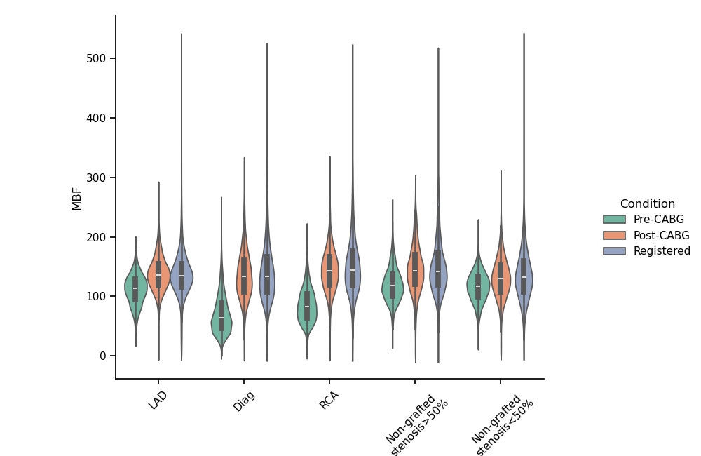
      <br/><em>MBF distribution</em>
    </td>
    <td align="center">
      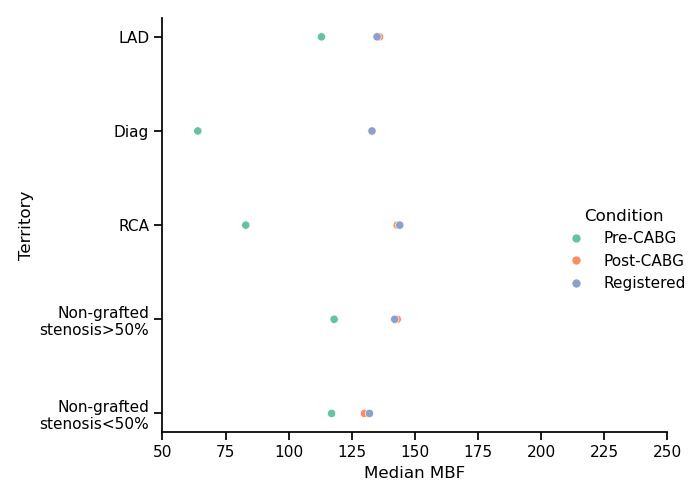
      <br/><em>Median MBF</em>
    </td>
  </tr>
  <tr>
    <td align="center">
      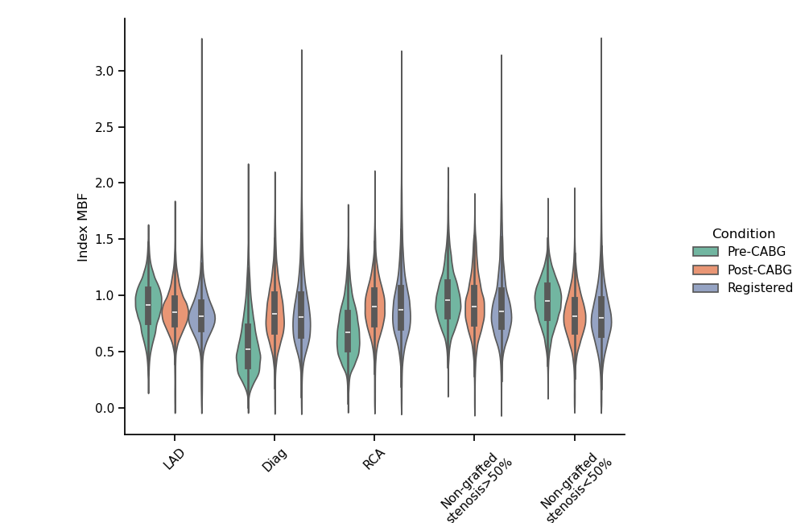
      <br/><em>Index MBF distribution</em>
    </td>
    <td align="center">
      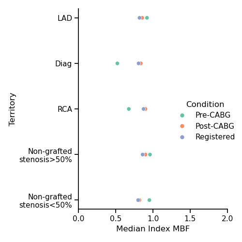
      <br/><em>Median Index MBF</em>
    </td>
  </tr>
</table>

Territories: LAD, Diag, RCA, and non-grafted regions (stenosis &gt;50% and &lt;50%). Registered medians track Post-CABG medians closely across territories. Elastix introduces visible upper-tail outliers in the MBF violins (long whiskers above ~300 mL/min/100 g), but the registered and post-CABG medians remain aligned, supporting acceptable registration quality.

---

### SU04

<table width="100%">
  <colgroup>
    <col style="width:60%"/>
    <col style="width:40%"/>
  </colgroup>
  <tr>
    <td align="center">
      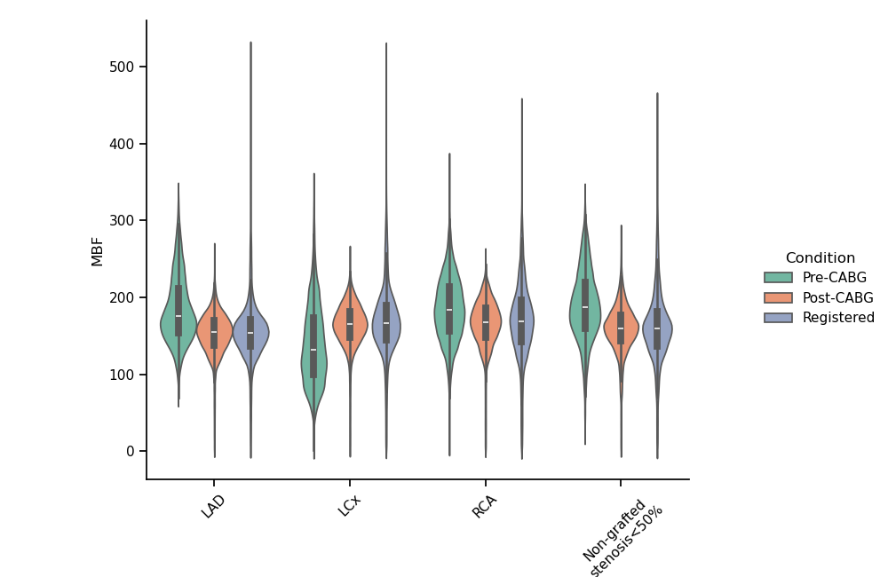
      <br/><em>MBF distribution</em>
    </td>
    <td align="center">
      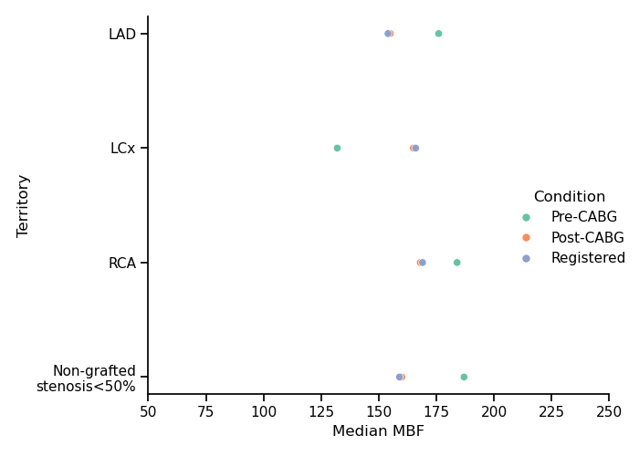
      <br/><em>Median MBF</em>
    </td>
  </tr>
  <tr>
    <td align="center">
      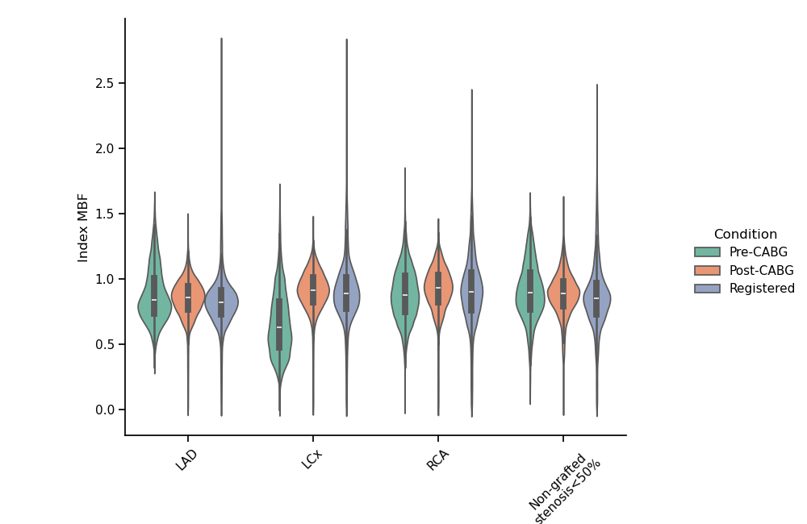
      <br/><em>Index MBF distribution</em>
    </td>
    <td align="center">
      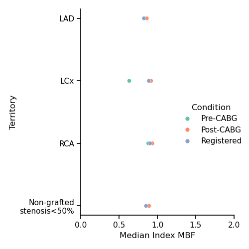
      <br/><em>Median Index MBF</em>
    </td>
  </tr>
</table>

Territories: LAD, LCx, RCA, and non-grafted stenosis &lt;50%. Registered (blue) and Post-CABG (orange) medians agree within each territory where both are shown. Pre-CABG medians are generally higher in this case, reflecting the expected pre-operative perfusion pattern. Outliers are present in the registered MBF distributions but do not shift the medians substantially.

---

### SU06

<table width="100%">
  <colgroup>
    <col style="width:60%"/>
    <col style="width:40%"/>
  </colgroup>
  <tr>
    <td align="center">
      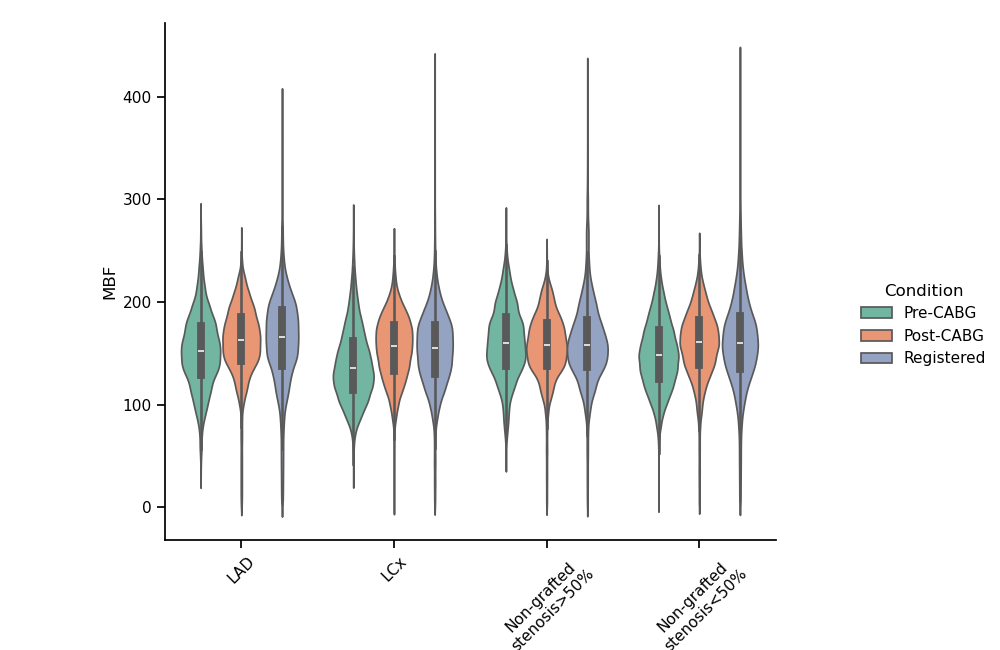
      <br/><em>MBF distribution</em>
    </td>
    <td align="center">
      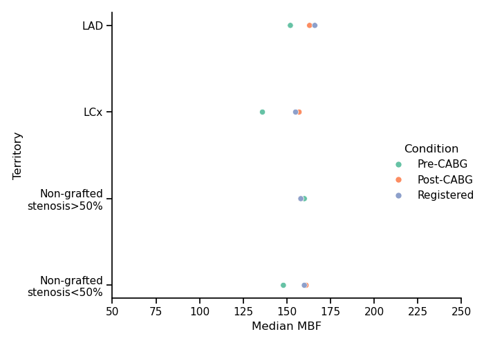
      <br/><em>Median MBF</em>
    </td>
  </tr>
  <tr>
    <td align="center">
      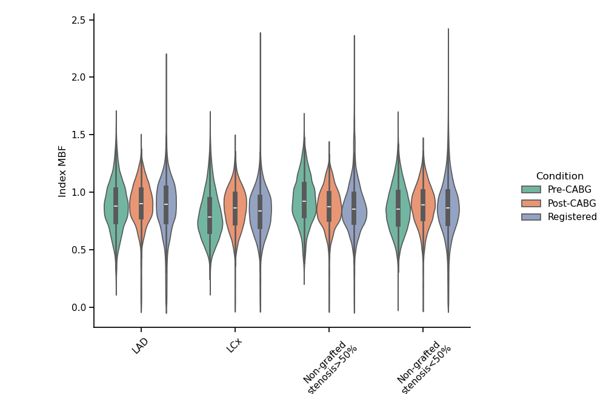
      <br/><em>Index MBF distribution</em>
    </td>
    <td align="center">
      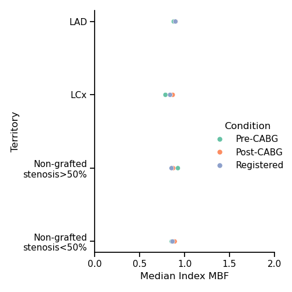
      <br/><em>Median Index MBF</em>
    </td>
  </tr>
</table>

Territories: LAD, LCx, and non-grafted regions (stenosis &gt;50% and &lt;50%). As with the other cases, median MBF and median Index MBF were used to assess registration because the full distributions contain Elastix-related outliers. Registered (blue) distributions overlap closely with Post-CABG (orange) across territories.

---

### SU13

<table width="100%">
  <colgroup>
    <col style="width:60%"/>
    <col style="width:40%"/>
  </colgroup>
  <tr>
    <td align="center">
      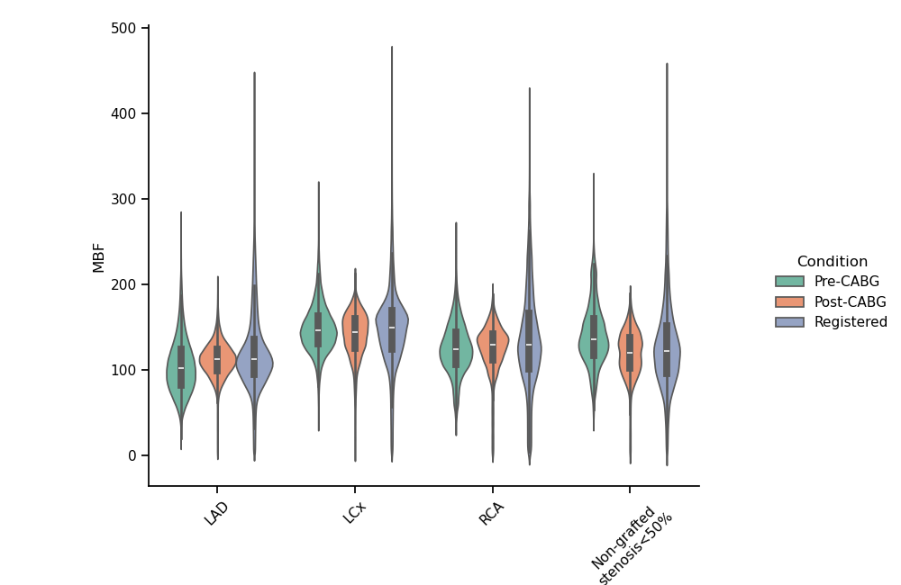
      <br/><em>MBF distribution</em>
    </td>
    <td align="center">
      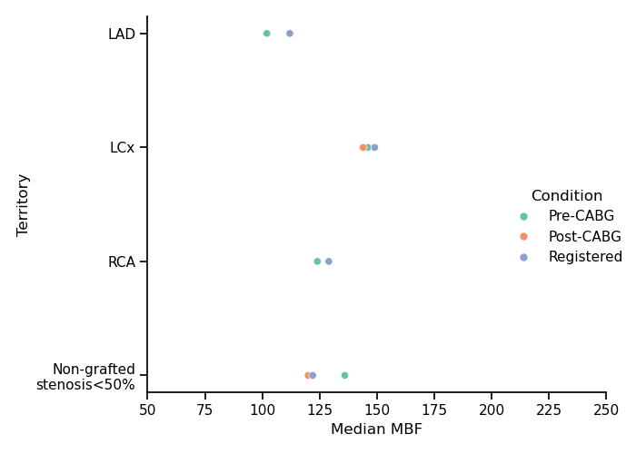
      <br/><em>Median MBF</em>
    </td>
  </tr>
  <tr>
    <td align="center">
      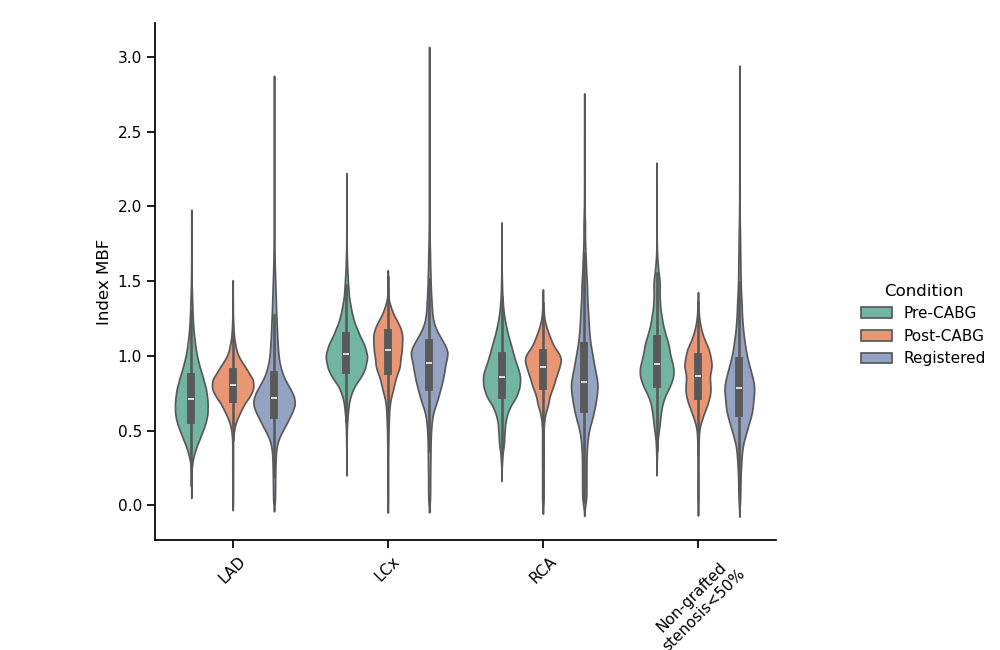
      <br/><em>Index MBF distribution</em>
    </td>
    <td align="center">
      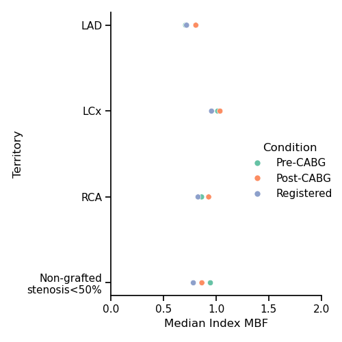
      <br/><em>Median Index MBF</em>
    </td>
  </tr>
</table>

Territories: LAD, LCx, RCA, and non-grafted stenosis &lt;50%. Registered medians are closely paired with the corresponding Pre-CABG or Post-CABG medians depending on territory. Index MBF median plots confirm that scan-normalized perfusion is preserved after registration.

---

## Summary

| Case | Territories assessed | Validation criterion |
|------|---------------------|----------------------|
| SU03 | LAD, Diag, RCA, non-grafted | Registered median MBF ≈ Post-CABG median MBF |
| SU04 | LAD, LCx, RCA, non-grafted | Registered median MBF ≈ Post-CABG median MBF |
| SU06 | LAD, LCx, non-grafted | Registered median MBF ≈ Post-CABG median MBF |
| SU13 | LAD, LCx, RCA, non-grafted | Registered median MBF ≈ Post-CABG median MBF |

Across all four cases, Elastix registration preserved territory-level **median** MBF and Index MBF despite introducing scattered outliers in the full distributions. Median-based comparison was therefore adopted as the validation metric. The inverse-transform and territory-projection pipeline (`project_territory_map.py`) ensures that territory labels are evaluated on the native post-CABG geometry, providing a fair comparison between the registered and unregistered perfusion data.

---

## Reproducing the Validation

```bash
# Step 1: Project territory labels back to native post-CABG space
python project_territory_map.py -case SU03

# Step 2: Generate validation figures
python validate_registeration.py --case SU03 --tags "LAD+Diag+RCA"
```

Figures are saved to the `figures/` directory as `{CASE}_Figure_{1-4}.png`, where:

| Figure | Content |
|--------|---------|
| Figure 1 | MBF distribution (violin) |
| Figure 2 | Median MBF (scatter) |
| Figure 3 | Index MBF distribution (violin) |
| Figure 4 | Median Index MBF (scatter) |